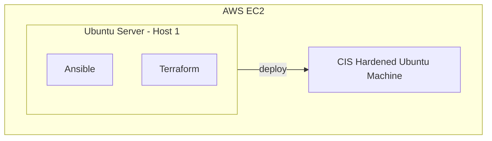

# Linux Hardening Automation Project
## project start date: 2024/11/08
The initial scope of this project is to create a method to easily and quickly deploy Secuirty Hardened Debian virtal machines, via a series of automation and scripting tools. then to covert those machines to easily and rapidly deployable OVA images which can act as a Secure golden image. The deployment for my specific case will be via VMware fussion on a Macbook pro. 

**Certain linters are used in this project to ensure code integrity and best practices are followed:**
- bash-lint.yml
- ansible-lint.yml
- markdown-lint.yml

***note all linters currently need the rule set customising to be effective***

### Basic Design for this project:

