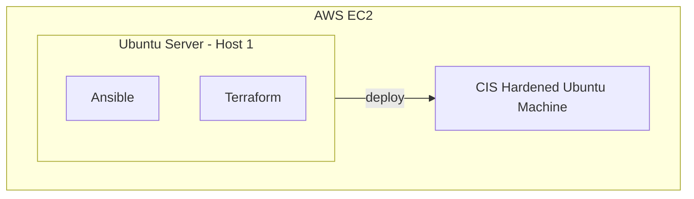

# Linux Hardening Automation Project
## project start date: 2024/11/08
The initial scope of this project is to create a method to easily and quickly deploy Secuirty Hardened Debian virtal machines, via a series of automation and scripting tools. then to covert those machines to easily and rapidly deployable OVA images which can act as a Secure golden image. The deployment for my specific case will be via amazon AWS. ***Note if like me you are using the AWS free instance please remeber to either shutodwn or delete the VMs after use.***
**Certain linters are used in this project to ensure code integrity and best practices are followed:**
- bash-lint.yml
- ansible-lint.yml
- markdown-lint.yml

**note all linters currently need the rule set customising to be effective**
### Basic Design for this project:

## Deploy and set up of initial EC2 image: ***Note: Future state of the bellow is that this deployment will be handled by GitHub actions but manual creation will be done until the fundamental deploy scripts for the secure host are finalised and optimised.***
1. **create a vpc for your deployment**:
    - a. Go to the [VPC Dashboard](https://console.aws.amazon.com/vpc/) in the AWS Management Console.
    - b. Click **Create VPC**.
    - c. Configure the VPC settings:
        - i. **Name tags**: Name the VPC (e.g., `Linux-Hardening-Test-vpc`) 
        - ii.**IPv4 CIDR block**: Choose a CIDR block that provides sufficient IPs, like `10.128.1.0/29`. (Providing 5 usable hosts for this network)
        - iii. Click **Create VPC**.
    - d. **Create a Private Subnet**:
        - i. Go to **Subnets** under the VPC Dashboard.
        - ii. Click **Create subnet**.
        - iii. Select the VPC you created above.
        - iv. Configure the subnet:
            - **Name tag**: Enter a name (e.g., `deploy-subnet`).
            - **Availability Zone**: Select an availability zone.
            - **IPv4 CIDR block**: Specify a subnet CIDR within the VPC’s range (e.g., `10.128.1.0/29`).
        - v. Click **Create subnet**.
    - e. **Disable Auto-assign Public IP for the Subnet**:
        - i.  Go to the **Subnets** dashboard, select your newly created subnet.
        - ii. Click on **Actions** > **Edit subnet settings**.
        - iii. **Disable auto-assign public IPv4**. This ensures instances in the subnet do not receive public IP addresses by default.
        -  iv. Click **Save**.
    - f. **Create a Security Group for Internal Communication**:
        - i. Go to **Security Groups** in the VPC Dashboard.
        - ii. Click **Create security group**.
        - iii. Configure the security group:
            - **Name tag**: Enter a name (e.g., `hardening-sg`).
            - **VPC**: Select the VPC you created earlier.
        - iv. **Inbound rules**:
            - Click **Add rules**.
            - **Type**: Custom TCP Rule (or choose specific protocols if you only want specific ports).
            - **Port range**: Specify ports (e.g., `0-65535` for all ports, or specific ones).
            - **Source**: Choose `Custom` and enter the security group’s ID (`sg-xxxx`). This allows instances within the security group to communicate with each other.
        - v. **Outbound rules**:
            - The default outbound rule allows all traffic. You may keep this or restrict it as desired.
        - vi. Click **Create security group**.
2. **Launch EC2 Instances in the Private Subnet**
    - a. Go to the [EC2 Dashboard](https://console.aws.amazon.com/ec2/).
    - b. Click **launch Instance**
    - c. **Select an Amazon Machine Image (AMI)** of Ubuntu
    - d. **Choose an Instance Type**.
    - e. **Configure Instance Details**:
        - **Metwork**: Select your VPC
        - **Subnet**: Select your subnet
        - **Auto-assign public IP**: Disabled 
    - f. **Add Storage** and **Tags** as needed.
    - g. **Configure Security Group**:
        - i.  Select **Choose an existing security group**.
        - ii. Choose the security group you created earlier.
    - h. **Review and Launch** the instance.
3. **Allow outbound-only internet access from the hosts to allow for updates etc**:
    - a. Ensure that the VPC has a public facinf subnet
    - b. **Creaate a NAT gateway**: 
        - i. 1. Go to the **VPC Dashboard** in the AWS Console.
        - ii. Under **NAT Gateways**, click **Create NAT Gateway**.
        - iii. **Choose a public subnet** for the NAT Gateway. This subnet needs an **Internet Gateway** attached to it to access the internet.
        - iv. In **Elastic IP Allocation ID**, click **Allocate Elastic IP** and select the allocated IP.
        - v. Click **Create NAT Gateway**.
    - c. **Update the Private Subnet’s Route Table**:
        - i. In the **VPC Dashboard**, go to **Route Tables**.
        - ii. Identify the **route table** associated with the private subnet where your instance is located.
            - You may have to look under **Subnets** to confirm which route table is associated with your private subnet.
       - iii. Click on the private subnet’s route table and go to the **Routes** tab.
       - iv. Click **Edit routes**.
       - v. Add a new route:
            - **Destination**: `0.0.0.0/0` (this route will cover all outbound internet traffic).
            - **Target**: Select the **NAT Gateway** you created.
            - Click **Save changes**.

## project Script editing and initial deployment phase starting: 2024/11/09
Creating an action to depoly non main branches to development as long as there are no merge confilcts